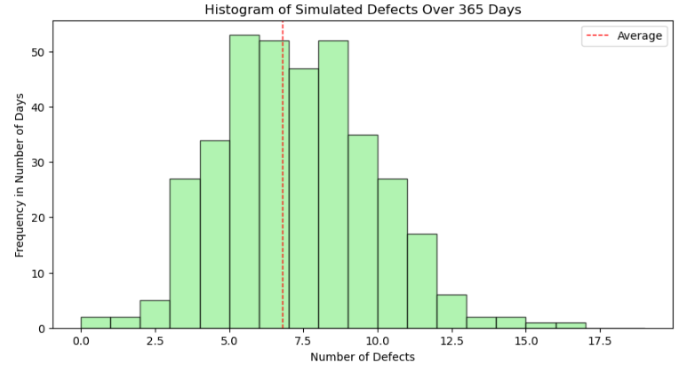
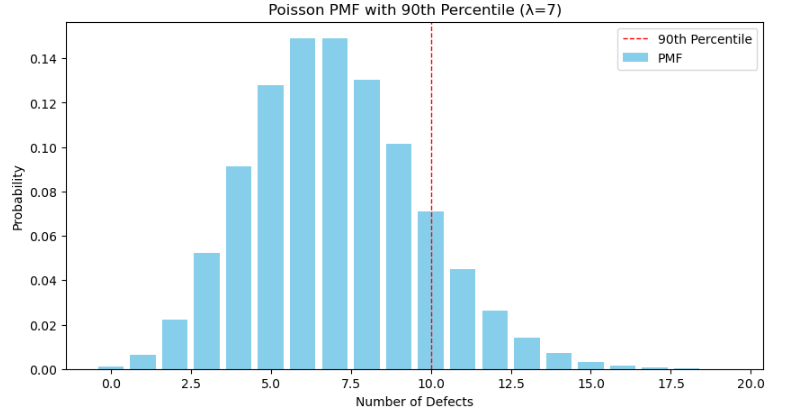
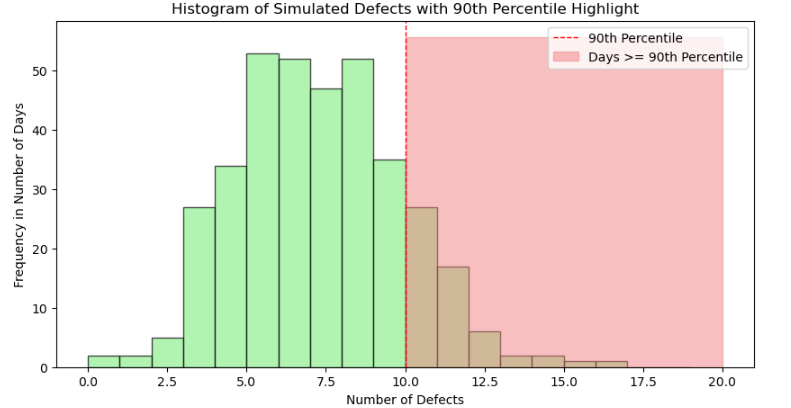

# Product Defects Project

For this exercise, we are in charge of monitoring the number of products from a specific factory and We will investigate certain attributes of the **Poisson distribution** to get an intuition for how many defective objects we should expect to see in a given amount of time.

The work is divided into two parts:
- Distribution in Theory
- Distribution in Practice

## Findings

1. The average number of defects per day from the simulated dataset does not differ to much from the given rate parameter of the Poisson Distribution(7). The red dashed line indicates the average number of defects per day from the simulated dataset. This helps visually compare the average to the distribution of defects.

2. 10 is the number of defects that correspond to the 90th percentile of a poisson distribution with a expected value of 7. This means that on 90% of days, the number of defects would be less than or equal to this value.

3. 0.20 is the proportion of days that have defects greater or equal to the 90th percentile. This is slightly higher than the expected 10% due to the randomness in the Poisson distribution and the finite size of the dataset (365 days).

## Used Technologies

- Jupyter Notebook
- Python Programming Language
- Matplotlib
- NumPy
- SciPy.stats
